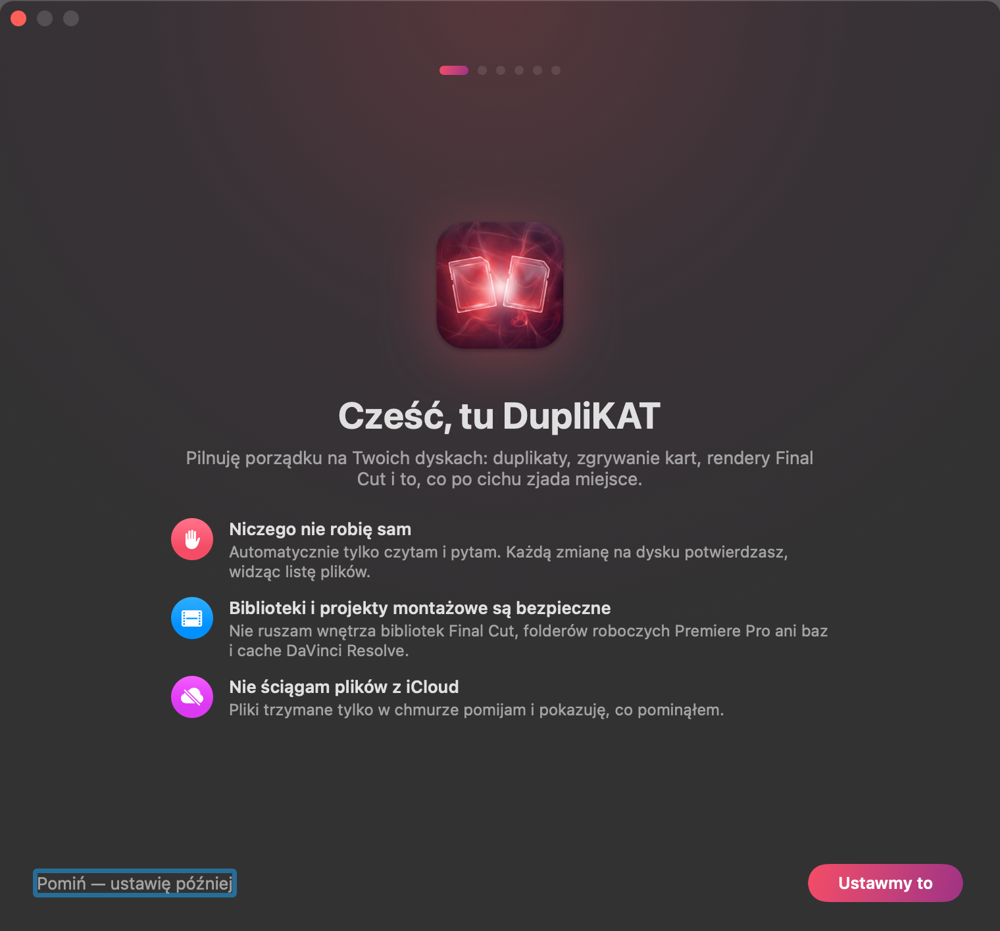
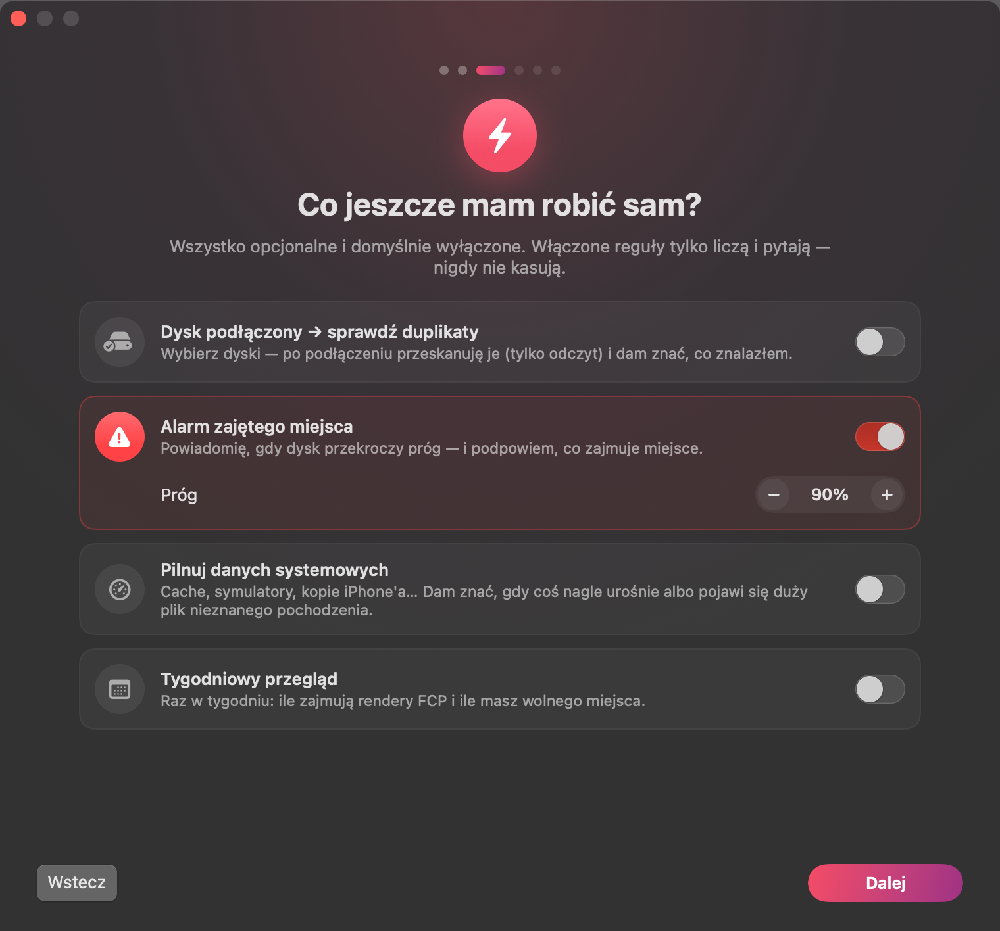
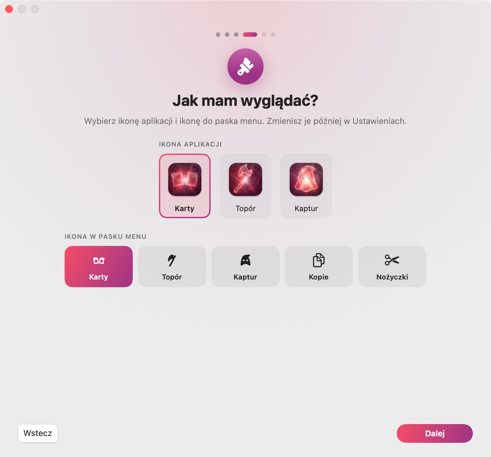

# DupliKAT

Natywna aplikacja macOS do porządków na dyskach twórcy wideo: duplikaty, karty z aparatu, kopie zapasowe
i pliki robocze programów do montażu. Napisana w SwiftUI, po polsku i po angielsku (wybór języka w pierwszym kroku przewodnika).

*A native macOS app (Polish and English UI) for video creators: finds duplicates, tells you what from a camera card is
already backed up and where, compares folders, and shows editor render/proxy/cache files — it never deletes
or copies anything without your confirmation.*

<p align="center">
  
  
  
</p>

## Zasada

**DupliKAT niczego nie robi sam.** Automatycznie tylko czyta i pyta. Każda zmiana na dysku (Kosz, przeniesienie,
kopia, klon APFS) przechodzi przez okno z listą plików i rozmiarem. Jedyny wyjątek to reguła „kopiuj brakujące
z karty automatycznie”, którą włączasz sam — i ona tylko dodaje pliki, niczego nie usuwa ani nie nadpisuje.

## Co potrafi

| Tryb | Co robi |
|---|---|
| **Duplikaty** | Pliki o identycznej zawartości (rozmiar → fragmenty → pełny SHA-256), niezależnie od nazwy i folderu |
| **Podobne zdjęcia** | Ten sam obraz w innym rozmiarze/formacie i serie z aparatu (Vision) |
| **Podobne wideo i audio** | Ten sam materiał w innym eksporcie, kodeku lub rozdzielczości |
| **Karty z aparatu** | Co z karty jest już zgrane (i w jakim folderze), a czego nie ma nigdzie → „Skopiuj do…” / „Przenieś do…” |
| **Porównaj foldery** | Czy wszystko z A jest w B (po zawartości), zapisane pary, dogrywanie brakujących, lustro |
| **Dyski** | Klik w dysk: miejsce, model i prędkość łącza (USB/Thunderbolt), rola backupu, akcje i historia działań |
| **Pliki montażowe** | Rendery, podglądy, proxy i cache z Final Cut Pro, Premiere Pro / After Effects, DaVinci Resolve i CapCut |
| **Dane systemowe** | Co po cichu zajmuje miejsce (cache, symulatory, kopie iPhone'a) — tylko podgląd |

Bezpieczeństwo:
- biblioteki i projekty montażowe (FCP, Premiere, DaVinci), szablony Motion i biblioteka Zdjęć nigdy nie są
  proponowane do usunięcia;
- pliki trzymane tylko w iCloud są pomijane (odczyt wymusiłby pobieranie);
- kopie są sprawdzane bajt po bajcie; kopiowanie nigdy nie nadpisuje.

Backupy i ich kopie: oznaczasz dysk jako „backup” (np. M), a inny jako „kopia backupu M” (np. M2) — przy każdym pliku
widać, na ilu dyskach jest, a DupliKAT liczy, co dograć na kopię (z zachowaniem folderów). Zapamiętuje listę plików
dysków (bez treści), więc kopia na odłączonym dysku też się liczy.

Wyniki w czterech widokach: lista, kompaktowa lista, siatka miniatur i foldery (pary folderów ze wspólnymi plikami — decyzja o całym folderze naraz). Zaznaczanie z góry: wszystkie kopie (zostaw najstarszy/najnowszy/na dysku…), pliki z wybranych folderów albo „zostaw w tych folderach”.

Do tego: ikona w pasku menu (klik = okienko ze statusem, procentem, szybkimi akcjami i dyskami — klik w dysk pokazuje jego akcje; dwuklik = okno, prawy klik = menu reguł). Po skończonym skanie: dźwięk, wynik w okienku z przyciskiem „Pokaż wynik” i powiadomienie, reguły po podłączeniu karty/dysku,
alarm zajętego miejsca, przewodnik pierwszego uruchomienia i samouczek „co jest co”.

## Skróty i Stream Deck

Globalne skróty (Ustawienia → Skróty) i adresy do wklejenia w Stream Decku (akcja „Website”):

| Adres | Co robi |
|---|---|
| `duplikat://check-selection` | Sprawdza, czy pliki/foldery zaznaczone w Finderze mają gdzieś kopię (w tle, postęp i wynik w pasku menu) |
| `duplikat://check-card` | Sprawdza podłączoną kartę |
| `duplikat://duplicates-selection` | Szuka duplikatów w zaznaczonym folderze |
| `duplikat://toggle` | Pokazuje / chowa okno |
| `duplikat://system` | Mierzy dane systemowe |
| `duplikat://settings` | Otwiera Ustawienia |
| `duplikat://open?mode=transfer` | Otwiera wybrany tryb (`duplicates`, `photos`, `media`, `transfer`, `backup`, `fcp`, `system`) |

## Instalacja

Pobierz `DupliKAT.dmg` z [Releases](../../releases), przeciągnij aplikację do Aplikacji.
Aplikacja nie jest notaryzowana przez Apple — przy pierwszym uruchomieniu kliknij ją **prawym przyciskiem → Otwórz**.
Wymaga macOS 14 lub nowszego (Apple Silicon i Intel).

## Budowanie

```bash
swift test --scratch-path ~/Library/Caches/DubelBuild/test   # testy silnika (DubelCore)
./dev-run.sh               # uruchomienie deweloperskie (osobne ustawienia)
./make-dmg.sh              # wersja uniwersalna → dist/DupliKAT.dmg
```

Struktura: `Sources/DubelCore` — logika bez UI (skanowanie, porównywanie, podobieństwo, karty, pliki montażowe),
`Sources/Dubel` — aplikacja (AppKit + SwiftUI), `Sources/dubel-probe` — skany z terminala (tylko odczyt),
`Vendor/MidniteUIKit` — komponenty UI (kopia; `./sync-kit.sh` odświeża ją z projektu źródłowego).

## Licencja

Kod: [MIT](LICENSE) © 2026 David Midnite. Ikony aplikacji (kat1–3) nie są objęte licencją MIT — wszelkie prawa zastrzeżone.
